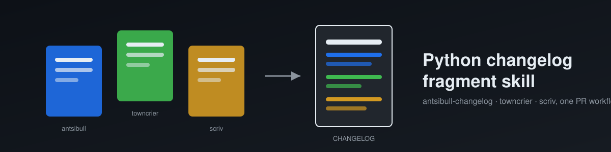

# py-changelog-fragment-skill



[](https://github.com/lowlysre/py-changelog-fragment-skill/actions/workflows/agnix.yml)
[](LICENSE)
[](https://skills.sh/lowlysre/py-changelog-fragment-skill)

An agentic skill for creating and validating Python changelog fragments in a PR workflow, covering `antsibull-changelog`, `towncrier`, and `scriv`. The skill identifies which tool a project uses, then loads the matching reference doc for installation, fragment format, naming, validation commands, troubleshooting, and best practices.

This README follows [Diátaxis](https://diataxis.fr): a quickstart tutorial, task-oriented how-to guides, and an explanation of why this exists.

## Install

The [`skills` CLI](https://www.npmjs.com/package/skills) reads this repo's `skills/` directory directly and writes the skill into whichever agent's directory you target:

```bash
npx skills add lowlysre/py-changelog-fragment-skill --skill python-changelog-fragments
```

Omit `--agent` and it prompts for a target; pass one to skip the prompt, e.g. `-a claude-code`, `-a copilot`, `-a cursor`. See the [how-to guides](#how-to-guides) below for manual installation and other options.

## Tutorial: try it in two minutes

1. Install the skill into a scratch project:

   ```bash
   cd your-python-project
   npx skills add lowlysre/py-changelog-fragment-skill --skill python-changelog-fragments -a claude-code
   ```

2. Open the project in that agent and ask it to add a changelog fragment for a change you just made, for example: "add a changelog fragment for the bugfix I just committed."
3. The agent checks for `changelogs/config.yaml` (antsibull-changelog) or a `[tool.towncrier]` section in `pyproject.toml` (towncrier), writes a correctly named fragment file in the right directory, and runs the matching lint command (`antsibull-changelog lint` or `towncrier check`) before telling you it's done.

## How-to guides

### Install to a specific agent

```bash
npx skills add lowlysre/py-changelog-fragment-skill --skill python-changelog-fragments -a claude-code -a cursor
```

### Install without npx

Copy the skill directory straight into whatever path your tool scans for skills:

```bash
git clone https://github.com/lowlysre/py-changelog-fragment-skill.git /tmp/py-changelog-fragment-skill
cp -r /tmp/py-changelog-fragment-skill/skills/python-changelog-fragments .github/skills/python-changelog-fragments
```

Swap `.github/skills/` for `.claude/skills/`, `.agents/skills/`, `.cursor/skills/`, etc. depending on the target tool.

### Validate the skill files locally

```bash
npx agnix .
```

CI runs the same check in strict mode on every push and pull request (see [`.github/workflows/agnix.yml`](.github/workflows/agnix.yml)).

## Explanation

`antsibull-changelog`, `towncrier`, and `scriv` all solve the same problem: a PR-scoped snippet that gets collected into the real changelog at release time, instead of a maintainer reconstructing the changelog from commit history at cut time. They disagree on format and directory convention, so a generic "write a changelog entry" instruction either guesses wrong or forces the agent to read all three tools' docs on every PR.

This skill front-loads the disambiguation instead: it checks for `changelogs/fragments/` versus a `[tool.towncrier]` or `[tool.scriv]` config block, then loads only the reference doc for the tool actually in use. The troubleshooting and best-practices docs exist separately from the per-tool references because most of their content, one fragment per user-facing change, validate before committing, don't hand-edit generated output, applies to both tools and would otherwise get duplicated across two files.
